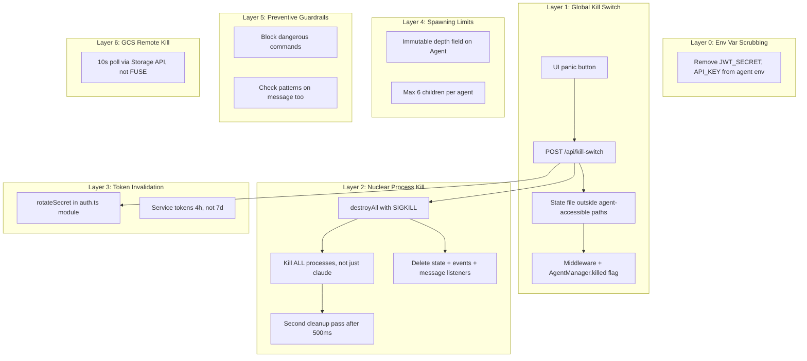

# Kill Switch Implementation Plan (Revised After Security Review)

## Security Review Summary

Three security analysts reviewed the original plan. Their key findings, verified against the actual code:

**Critical bugs in the original plan:**

- **JWT rotation would silently fail**: `src/auth.ts:9` captures `const JWT_SECRET = process.env.JWT_SECRET` once at import. Updating `process.env` does nothing — all existing tokens remain valid.
- **Kill switch file tamper-able by agents**: If stored in shared-context or anywhere under `/persistent`, agents can delete it via the symlink or FUSE mount.
- **Agents inherit server secrets**: `buildEnv()` passes `...process.env` including `JWT_SECRET` and `API_KEY`. Agents can forge tokens or authenticate as users.

**Gaps in the original plan:**

- Orphan cleanup only kills processes named `"claude"` — child bash/node/curl processes survive.
- `/persistent/tools/` auto-shimming is a persistence backdoor (agents write a malicious script, it runs on next container start).
- Blocked command patterns only checked on `create()`, not `message()`.
- Cascade destroy only goes one level deep — grandchild agents survive.
- Depth limits via parent chain walk are bypassable if a parent is destroyed (chain breaks, depth resets).
- GCS periodic sync is every 5 minutes (not 60s as originally stated) — too slow for kill switch polling.

---

## Problem Analysis

What happened: an orchestrator agent spawned sub-agents, which started autonomously reviewing/merging PRs and deploying to GCP. Even after the server was stopped, activity continued. Root causes:

- Agents inherit **all** env vars including `JWT_SECRET`, `API_KEY`, `GITHUB_TOKEN`, `ANTHROPIC_API_KEY` ([src/agents.ts](src/agents.ts) line 957)
- Processes spawn with `detached: true` (line 249), can outlive the server
- `dispose()` **preserves** state files so agents are **restored on restart** (line 626-640)
- Agent service tokens valid for **7 days** ([src/auth.ts](src/auth.ts) line 77)
- No spawning depth limits — agents spawn agents spawn agents
- No blocked patterns for `gh pr merge`, `gcloud deploy`, `terraform apply`
- `cleanupOrphanedProcesses()` only runs at startup, only kills processes named `"claude"`

## Architecture: Defense in Depth




---

## Layer 0: Environment Variable Scrubbing (NEW — highest priority)

The analysts unanimously identified this as the #1 issue. Agents should never have server-only secrets.

In [src/agents.ts](src/agents.ts) `buildEnv()` (line 956), explicitly delete secrets agents don't need:

```typescript
private buildEnv(): NodeJS.ProcessEnv {
  const env: NodeJS.ProcessEnv = {
    ...process.env,
    SHELL: "/bin/sh",
    CLAUDE_CODE_DISABLE_NONESSENTIAL_TRAFFIC: "1",
    AGENT_AUTH_TOKEN: generateServiceToken(),
  };
  delete env.CLAUDECODE;
  // NEW: Remove server-only secrets agents must never have
  delete env.JWT_SECRET;
  delete env.API_KEY;
  return env;
}
```

This prevents agents from forging tokens or authenticating as users. They keep `ANTHROPIC_API_KEY` and `GITHUB_TOKEN` (needed for their work), but lose the ability to impersonate the server.

---

## Layer 1: Global Kill Switch (the big red button)

### New file: `src/kill-switch.ts`

A module that manages a persistent killed state:

- **State file location**: `/tmp/platform/kill-switch.json` — NOT in shared-context, NOT under `/persistent` (both are agent-accessible). The `/tmp/platform/` directory is created at startup and not symlinked into any workspace.
- `**isKilled()**`: checks in-memory flag (fast path). Periodic file check every 5s for remote activation.
- `**activate(reason)**`: sets in-memory flag, writes local file, uploads to GCS via Storage API (not FUSE).
- `**deactivate()**`: clears flag, removes file, removes from GCS.

### New endpoint: `POST /api/kill-switch`

In a new [src/routes/kill-switch.ts](src/routes/kill-switch.ts):

- `POST /api/kill-switch` with body `{ action: "activate" | "deactivate", reason?: string }` — requires auth, rejects `agent-service` tokens (only human users can activate).
- On **activate**: sets kill switch flag, then calls `agentManager.emergencyDestroyAll()`, then `cleanupAllProcesses()`, then `rotateJwtSecret()`, then schedules second cleanup pass at +500ms.
- On **deactivate**: clears kill switch, generates new JWT secret (so the human must re-authenticate).
- `GET /api/kill-switch` — returns current status.

### Kill switch middleware + code-level flag

Two layers of protection:

1. **Middleware** in [server.ts](server.ts) before auth: if `isKilled()`, all `/api/*` requests except `/api/kill-switch`, `/api/health`, `/api/auth/token` return `503`.
2. `**AgentManager.killed` flag**: `create()` and `message()` check this flag before spawning. This catches in-flight requests that got past middleware before the flag was set.

### UI panic button

Red button in the UI header. Kill-switch-active banner with deactivate option.

---

## Layer 2: Nuclear Process Kill (revised)

### Enhanced `emergencyDestroyAll()` in [src/agents.ts](src/agents.ts)

Replaces the gentle `destroyAll()` for kill switch scenarios:

1. **Set `this.killed = true`** immediately — blocks `create()` and `message()` at the code level
2. **Clear message bus listeners** — prevents auto-delivery from re-triggering agent runs during shutdown
3. **SIGKILL immediately** (not SIGTERM-then-SIGKILL) — for kill switch, we don't care about graceful shutdown
4. **Kill ALL non-init processes** using `ps -eo pid,ppid,comm` — not just those named `"claude"`. Kill everything that isn't PID 1 or the current server process. This catches bash, node, curl, git, etc.
5. **Delete ALL state files** in the agent-state directory AND the events directory
6. **Write a tombstone file** to the state directory that `loadAllAgentStates()` checks on startup — if tombstone exists, skip all restoration even if FUSE delete failed
7. **Schedule second pass** at +500ms to catch anything that snuck through (agents mid-spawn when kill switch hit)

### Extract `cleanupAllProcesses()` from [server.ts](server.ts)

Move and enhance `cleanupOrphanedProcesses()` to a shared utility:

```typescript
// Kill ALL processes except PID 1 and the server itself
function cleanupAllProcesses(): void {
  const output = execFileSync("ps", ["-eo", "pid,ppid,comm"], ...);
  for (const line of output.split("\n")) {
    // Kill everything that isn't init (1) or this server (process.pid)
    if (pid !== 1 && pid !== process.pid) {
      process.kill(pid, "SIGKILL");
    }
  }
}
```

---

## Layer 3: Token Invalidation (fixed)

### Fix the const capture bug

**The original plan would silently fail.** In [src/auth.ts](src/auth.ts) line 9, `JWT_SECRET` is a `const` captured at module load. Updating `process.env.JWT_SECRET` has no effect on signing/verification.

**Fix**: Change to a `let` with a `rotateSecret()` function:

```typescript
// src/auth.ts
let jwtSecret = process.env.JWT_SECRET!;
let apiKey = process.env.API_KEY || "";

export function rotateJwtSecret(): string {
  const newSecret = crypto.randomBytes(32).toString("hex");
  jwtSecret = newSecret;
  process.env.JWT_SECRET = newSecret;
  // Reset sanitize cache so the new secret gets redacted in logs
  resetSanitizeCache();
  return newSecret;
}
```

All `signJwt()` and `verifyJwt()` calls use `jwtSecret` (the mutable variable) instead of the old const.

### Shorten service token lifetime

In [src/auth.ts](src/auth.ts) line 77, reduce from **7 days** to **4 hours**:

```typescript
exp: now + 4 * 3600, // 4 hours (matches session TTL)
```

---

## Layer 4: Spawning Depth Limits (improved)

### Immutable depth field

The code reviewer identified that walking the parent chain at runtime is bypassable — if a parent is destroyed, the chain breaks and depth resets. **Fix**: store depth as an immutable field on the `Agent` type at creation time.

In [src/types.ts](src/types.ts), add `depth: number` to the `Agent` interface.

In [src/agents.ts](src/agents.ts) `create()`:

```typescript
const parentAgent = opts.parentId ? this.get(opts.parentId) : undefined;
const depth = (parentAgent?.depth ?? 0) + 1;
if (depth > MAX_AGENT_DEPTH) {
  throw new Error(`Maximum agent depth of ${MAX_AGENT_DEPTH} exceeded`);
}

// Count existing children of same parent
if (opts.parentId) {
  const siblingCount = this.list().filter(a => a.parentId === opts.parentId).length;
  if (siblingCount >= MAX_CHILDREN_PER_AGENT) {
    throw new Error(`Maximum of ${MAX_CHILDREN_PER_AGENT} children per agent exceeded`);
  }
}

const agent: Agent = { ..., depth };
```

Add to [src/guardrails.ts](src/guardrails.ts):

```typescript
export const MAX_AGENT_DEPTH = 3;
export const MAX_CHILDREN_PER_AGENT = 6;
```

---

## Layer 5: Preventive Guardrails (expanded)

### Block dangerous operations

In [src/guardrails.ts](src/guardrails.ts), add to `BLOCKED_COMMAND_PATTERNS`:

```typescript
/gh\s+pr\s+merge/i,
/gh\s+pr\s+approve/i,
/gcloud\s+.*\s+deploy/i,
/terraform\s+(apply|destroy)/i,
/git\s+push\s+.*--force/i,
```

### Apply patterns on `message()` too

The code reviewer confirmed `validateMessage()` in [src/validation.ts](src/validation.ts) does NOT check blocked patterns — only `validateCreateAgent()` does. Fix by adding the same check to `validateMessage()`. This closes the gap where an agent gets an innocent initial prompt, then receives blocked content via follow-up messages.

**Caveat**: These patterns are speed bumps, not walls. Agents with `--dangerously-skip-permissions` can run any command autonomously regardless of what was in the prompt.

---

## Layer 6: GCS-Based Remote Kill (revised)

The original plan said to piggyback on the existing 60s periodic sync — but that sync is actually **every 5 minutes** (`src/storage.ts:272`), and uses FUSE which has caching delays.

**Revised approach:**

- **Own polling interval**: 10 seconds (not 60s or 5min), on a dedicated `setInterval`
- **Use GCS Storage API directly** (not FUSE) — avoids the FUSE stat cache which can delay file visibility by 60s+
- **Read from a path agents cannot write to** — either a separate GCS bucket with read-only SA access, or a specific prefix with object ACLs. For the initial implementation, use the same bucket but check via API (agents would need to know the exact key to delete it, and we'll also rely on Layer 1's local file + in-memory flag as the primary mechanism)

```bash
# Emergency remote activation:
echo '{"killed":true,"reason":"emergency"}' | gsutil cp - gs://your-bucket/platform/kill-switch.json
```

---

## Layer 7: Persistence Backdoor Hardening (NEW)

### `/persistent/tools/` auto-shimming

The infrastructure analyst identified that [entrypoint.sh](entrypoint.sh) lines 64-79 create executable shims for everything in `/persistent/tools/`, prepended to `$PATH`. An agent can write `/persistent/tools/git` to shadow the real `git` on the next container start.

**Fix options (choose one):**

- **Option A (simplest)**: Remove the auto-shimming entirely from `entrypoint.sh`. If persistent tools are needed, add them manually.
- **Option B (safer)**: Add a SHA256 manifest file that must be signed/verified before shimming. Only create shims for tools listed in a trusted manifest.

Recommend **Option A** for now — remove the feature. It can be re-added with proper integrity checks later.

### Startup safety check

On server startup, after `restoreAgents()`, check for the kill switch tombstone file. If present, skip agent restoration and wipe all state.

---

## Recommended Infrastructure Changes (non-code, for later)

These were identified by the infrastructure analyst but are outside the application code:

- **VPC egress firewall rules** — restrict which external APIs agents can reach (highest-impact infra change)
- **Separate read-only GCS bucket** for the kill switch file (prevents agent tampering)
- **Downgrade `storage.objectAdmin`** to `objectViewer` + `objectCreator` (prevents agent deletion of GCS objects)
- **External kill script** — a one-liner that disables the SA, revokes GitHub token, and deletes the Cloud Run service
- **Billing alerts** via Terraform budget resource
- **Fine-grained GitHub PAT** or GitHub App installation tokens (1h TTL) instead of broad PAT

---

## Files to Modify

- New: `src/kill-switch.ts` — Kill switch state management (local file + GCS API, outside agent paths)
- `src/agents.ts` — `buildEnv()` scrubs secrets, `emergencyDestroyAll()`, `killed` flag, depth field in `create()`
- `src/auth.ts` — `const` to `let` for JWT_SECRET, add `rotateJwtSecret()`, reduce service token to 4h
- `src/guardrails.ts` — Add `MAX_AGENT_DEPTH`, `MAX_CHILDREN_PER_AGENT`, new blocked patterns
- `src/validation.ts` — Apply `BLOCKED_COMMAND_PATTERNS` in `validateMessage()` too
- `src/types.ts` — Add `depth: number` to `Agent` interface
- `src/sanitize.ts` — Already has `resetSanitizeCache()`, just needs to be called from rotation
- `server.ts` — Kill switch middleware, extract + enhance orphan cleanup, startup tombstone check, GCS kill poll
- New: `src/routes/kill-switch.ts` — Kill switch API endpoints
- `entrypoint.sh` — Remove or harden `/persistent/tools/` auto-shimming
- UI files — Panic button component + kill-switch-active banner
